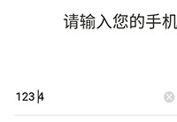

碰到个比较奇怪的问题

需求是input按344格式填写手机号，就像这样1** **** ****

首先，input通过设置`type="number"`或`type="tel"`，以及`pattern="[0-9]"`可以实现调起键盘为数字键盘。

之后就是处理格式问题，移动端可以直接监听input事件，对输入进行替换。

```JavaScript
// 将非数字全部替换掉
let phone = $mobileI.val()
phone = phone.replace(/[^0-9]/g, '')
// 分组成344，并且加上' '
var temp = []
temp[0] = phone.slice(0, 3)
temp[1] = phone.slice(3, 7)
temp[2] = phone.slice(7)
if (temp[2].length > 0) {
  temp[1] += ' '
  temp[0] += ' '
} else if (temp[1].length > 0) {
  temp[0] += ' '
}
// 将格式化好的手机号填入输入框
$mobileI.val(temp.join(''))
```

在移动端却会出现问题，在添加空格的情况下，光标会在最后一个字母前面。



通过selectionStart获取光标没有问题，通过设置selectionStart也没办法解决问题。

经过一系列测试，发现如果使用keyup事件调用，并不会出现这种情况，使用input事件才会这样。并且如果使用input事件调用，在keyup中检查selectionStart属性，会发现比keyup中的值小。所以这应该是移动端浏览器的bug。

我自己手机发现安卓下，chrome、UC、夸克都会有这个问题，QQ浏览器正常。

解决办法，input改为keyup，或者通过setTimeout将$mobileI赋值改成异步等方法。
